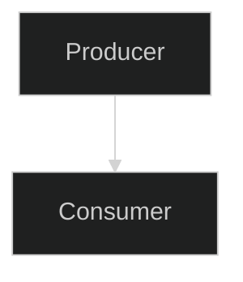

# Documentation Protocol

> Rules for how this project's documentation is maintained.
> All contributors (human and AI) must follow these rules.
> Rule text is canonical in GhostDev/template/docs/DOCS-PROTOCOL.md; local additions are marked (local).

---

## Document Hierarchy

```
docs/
├── CONTEXT.md                 ← THE living doc (state, decisions, next steps)
├── TODO.md                    ← Active sprint task tracker (checkbox items)
├── BACKLOG.md                 ← Non-blocking ideas, future work, deferred items
├── LOGBOOK.md                 ← Append-only session history
├── DOCS-PROTOCOL.md           ← This file (rules)
├── README.md                  ← Index with links to all docs
│
├── design/                    ← Architecture principles and diagrams (current + planned)
├── reference/                 ← System deep-dives (CURRENT implementation state)
├── research/                  ← Future ideas, spikes, studies (POSSIBLE future state)
├── guides/                    ← Practical how-to guides
├── impl/                      ← Archived completed FEATURE-IMPL.md trackers
├── report/                    ← Generated cross-cutting reports (IMPL coordination, audits)
└── archive/                   ← Settled decisions (do not modify)
```

Topic-cluster subfolders (e.g., a `products/` for a project that ships multiple products, or domain-scoped clusters like `movement/` or `troubleshooting/` for projects that accumulate enough docs in those areas) are added when they earn their existence — see Rule 11.

---

## Rules

### Rule 1: CONTEXT.md is the Single Source of Truth

`CONTEXT.md` contains:
- Current project state (what's built, what's running, what's broken)
- Architecture decisions (locked choices with rationale)
- Milestone status (what's done, what's next)
- Current sprint (active work)

**When project state changes, update CONTEXT.md FIRST.** Reference docs update only when the system they describe changes — not when milestones shift.

### Rule 2: Root Companion Documents

CONTEXT.md is supported by companion docs at the root:

| Root Doc | Purpose | Rules |
|---|---|---|
| **TODO.md** | Active sprint tasks with `[x]` checkboxes | Tracks current sprint only. Completed sprints roll up into CONTEXT.md "Completed" section. Reset per sprint cycle. |
| **BACKLOG.md** | Non-blocking issues, ideas, deferred work | Items here are NOT on the critical path. When an item becomes active, move it to TODO.md. Mark resolved items with `~~strikethrough~~` + date + one-line resolution. |
| **LOGBOOK.md** | Append-only session history | Each session appends: date, accomplishments, decisions, blockers, next steps. Never edit previous entries. |

CONTEXT.md = **strategic view** (where are we, where are we going).
TODO.md = **tactical view** (what am I doing right now, checkbox by checkbox).
BACKLOG.md = **parking lot** (not now, but don't forget).

### Rule 3: Reference vs Research — The Doc Lifecycle


**research/** = "How might we do X?" — proposals, studies, alternatives, benchmarks. NOT yet implemented.

**reference/** = "How does X work RIGHT NOW?" — current implementation, with code paths, file links, diagrams. This is the truth about **what exists today**.

**Lifecycle:**
1. **Idea stage** → write in `research/` with alternatives, pros/cons, benchmarks
2. **Accepted** → add to CONTEXT.md "Current Sprint", create tasks in TODO.md
3. **Implemented** → create or update `reference/` doc. The research doc either:
   - Gets archived to `archive/` (if fully superseded)
   - Stays in `research/` with a note: `> Partially implemented. See reference/x.md for current state.`
4. **Replaced** → old reference doc moves to `archive/`, new one takes its place

### Rule 4: Reference Docs Don't Track Status

Reference docs explain HOW systems work. They do NOT contain:
- Milestone percentages (→ CONTEXT.md)
- "TODO" lists (→ TODO.md or BACKLOG.md)
- Session logs (→ LOGBOOK.md)
- Progress tracking (→ CONTEXT.md)

Use `<!-- CURRENT -->` and `<!-- IMPROVEMENT -->` tags to distinguish implemented vs planned sections within reference docs.

### Rule 5: Technical Doc Quality Standards

Reference docs and research docs MUST include (where they fit for clearer explanations):

**Code snippets** — real code from the codebase, not pseudocode. Cite the file and line so a reader can jump to source:

```text
// From src/services/dispatcher.ext:88
public async Task DispatchAsync(Message msg, CancellationToken ct)
{
    var handler = _registry.Resolve(msg.Topic);
    await handler.HandleAsync(msg, ct);
}
```

**File path links** — clickable references to source:
- `[dispatcher.ext:88](../src/services/dispatcher.ext#L88)`
- Use relative paths from `docs/` folder

**Mermaid diagrams** — always dark themed:

```text

```

Not every section needs all three. Use judgment — the goal is that a reader can **find the code** and **see the relationships** without guessing.

### Rule 6: One Update Point Per Change

When something changes (e.g., "Service X is live"):
1. Update `CONTEXT.md` — milestone table, current sprint, timeline
2. Update `TODO.md` — check off the task
3. Append to `LOGBOOK.md` — what happened this session
4. Update the relevant reference doc ONLY IF the system description changed

Bad: updating architecture-diagrams.md, system-overview.md, vision.md, CONTEXT.md, and a reference doc for the same milestone.
Good: CONTEXT.md + TODO.md checkbox + LOGBOOK.md entry.

### Rule 7: Temporary Docs Self-Delete

Migration plans, spike docs, and transition guides include a note at the top:

```text
> Temporary document. Delete when migration is complete.
```

When complete, move to `archive/` (for historical reference) or delete outright.

### Rule 8: Architecture Decisions Live in CONTEXT.md

Why you chose technology X over Y, deployment topology A over B, framework P over Q — these go in the "Architecture Decisions (Locked)" table in CONTEXT.md. No separate `adr/` folder.

### Rule 9: README.md is the Index

`docs/README.md` is a directory listing with one-line descriptions. It links to CONTEXT.md as the entry point. Update it whenever docs are added, moved, or deleted.

### Rule 10: Root is ALL CAPS Only

The `docs/` root contains **only ALL CAPS filenames** (CONTEXT.md, TODO.md, BACKLOG.md, LOGBOOK.md, README.md, DOCS-PROTOCOL.md). Everything else lives in a categorized subfolder.

**Exception: `FEATURE-IMPL.md` living tracker docs at the root.** See Rule 12.

**Soft cap: at most 5 active IMPLs at root.** Beyond ~5, the root README is harder to scan than a clean subfolder. Overflow rule:

- If adding a 6th active IMPL would push the count over 5, move the **oldest plan-only IMPL** (no in-progress checkboxes, status `STATUS: PLAN-ONLY`) to `docs/impl/planned/`.
- Leave a **one-line stub** at root linking to the moved doc so cross-references don't rot: `> Moved to [impl/planned/FOO-IMPL.md](impl/planned/FOO-IMPL.md) on YYYY-MM-DD per Rule 10 cap.`
- Active IMPLs (any in-progress checkbox) are exempt from the cap — let real work breathe.
- **Parked (added 2026-09-13).** A tracker whose shipped phases are real but whose remaining boxes are gated on an operator decision, an external resource or another tracker, and that no session has touched for 20+ days, is neither plan-only nor active: move it to `docs/impl/parked/`, add a `> STATUS: PARKED <date> — <what it waits on>` line under the header, and leave the same one-line stub at root. Parked trackers are not promoted (Rule 12 needs every box ticked and a drafted reference doc) and are not delivered (methrep counts `impl/` top-level only); `/run-impl` does not see them. To resume: `git mv` it back to the root and delete the stub. Relative links inside a parked or planned tracker stay written from the `docs/` root.

### Rule 11: Topic Cluster Subfolders

When a system accumulates 3+ related docs, create a topic-cluster subfolder. **Clusters are project-specific** — different projects grow different clusters. Don't over-prescribe.

A non-exhaustive list of clusters observed in real projects using this methodology:

```
docs/
├── design/         ← architecture principles, diagrams, sprint planning
├── reference/      ← system deep-dives — current implementation
├── research/       ← spikes and proposals — possible future
├── archive/        ← settled decisions (do not edit)
├── impl/           ← archived FEATURE-IMPL trackers (Rule 12)
├── impl/planned/   ← Rule 10 overflow holding pen
├── report/         ← generated cross-cutting audits
├── guides/         ← practical how-to docs
├── products/       ← product visions and POC designs (multi-product projects)
├── tools/          ← third-party library docs
├── movement/       ← project-specific: deep dives on the movement system
├── mods/           ← project-specific: mod system design + dev guide
├── troubleshooting/← project-specific: bug-fix patterns
├── features/       ← project-specific feature deep-dives
└── legacy/         ← project-specific archived pre-rewrite docs
```

Rules of thumb:

- Create a cluster when 3+ docs share a topic. Don't create one speculatively.
- Topic clusters are **not** the same as `reference/`. Reference docs describe how a system works. Topic clusters are domain-scoped namespaces.
- The list above is descriptive, not prescriptive. New clusters are fine when they earn their existence.

### Rule 12: FEATURE-IMPL.md Living Tracker Pattern

When a major feature requires multi-session development — new service builds, product POC implementations, infra migrations — create a `FEATURE-IMPL.md` at `docs/` root.

**When to create one:** Does this feature have:
- Multiple implementation phases?
- Known bugs or test plans tracking across sessions?
- Enough complexity that a fresh AI session needs a dedicated continuation prompt?

If yes to 2+, create a `FEATURE-IMPL.md`. If single-session, just use TODO.md.

**Naming:** `{FEATURE}-IMPL.md` — ALL CAPS, hyphenated. Examples: `AUTH-IMPL.md`, `INGEST-IMPL.md`, `CHECKOUT-IMPL.md`, `MIGRATION-IMPL.md`.

**Required structure:**

```markdown
# Feature Name — Implementation Tracker

> Living design+status doc for {feature}.
> See `{path}` for {related doc}.
> Follows DOCS-PROTOCOL.md Rule 12.
> Updated: {date}

## AI Continuation Prompt
{Context files to read, implementation files, current state summary.
 So a fresh AI session can pick up where the last left off.}

## Open Questions
{Per Rule 13 — ≤3 ambiguity-targeted items, resolved or default-accepted before P1 starts.}

## Architecture
{Key design decisions, diagrams, constraints.}

## Current State ({date})
{What's working, what's not. Plain prose, not checkboxes.}

## Known Bugs
{BUG.N format: symptom, suspected cause, debug approach.}

## What Needs Testing
{TEST.N format: step-by-step test plans.}

## Implementation Status
{Table: Phase | State | Model | Description}
  - Model column: "Sonnet" for execution/wiring tasks following existing patterns.
    "Opus" for novel architecture/design tasks requiring new abstractions.

## Checklist
{Checkbox items grouped by phase. Use FEATURE.PHASE.N ID format.}

## Key Files Reference
{Table: File | Purpose}

## Architecture Notes
{Why decisions were made — the non-obvious stuff future sessions need.}
```

**Lifecycle:**
1. **Create** when the feature moves from research to active implementation
2. **Reference** from CONTEXT.md "Current Sprint" and TODO.md
3. **Update** each session (Current State date, checklist checkboxes, known bugs)
4. **Promote** when complete — see Promotion Process below

**Promotion Process (complete IMPL → archived tracker + reference doc):**

When all phases are done **AND** the following gates pass:

- **All checklist items checked** (no `[ ]` remaining).
- **No open `Known Bugs`.** Resolved bugs may stay listed with `~~strikethrough~~` + resolution.
- **`reference/{feature}.md` already drafted** — distilled, reader-focused, follows the structure below. Promotion creates nothing new; it moves what already exists.
- **Test suite green** — all tests touching the IMPL's source files pass. If tests don't exist for the IMPL's surface, the IMPL header MUST carry an explicit `tests-deferred: <reason>` flag and an entry in BACKLOG.md to write them within the next sprint.

If any gate fails, promotion is refused. Use the `/promote-impl` skill (when available) which mechanically verifies these gates before file moves.

1. **Move** `docs/{FEATURE}-IMPL.md` → `docs/impl/{FEATURE}-IMPL.md`
2. **Create** `docs/reference/{feature-name}.md` — clean reference doc for the current implementation. Distilled, reader-focused. Must include:
   - **Overview** — one-paragraph summary
   - **Architecture** — dark-themed mermaid diagram
   - **Key Files** — table with `[file.ext:line](relative/path.ext#Lline)` links
   - **Code snippets** — real code, each with file:line attribution
   - **Usage / API** — how to use the system (if user- or dev-facing)
   - **Caveats** — non-obvious constraints
   - `<!-- CURRENT -->` / `<!-- IMPROVEMENT -->` tags where applicable
   - NO checklists, NO milestone %, NO session logs
3. **Update `docs/CONTEXT.md`** — milestone done, remove from "Current Sprint", add reference link to Documentation Index
4. **Update `docs/TODO.md`** — mark done or remove
5. **Update `docs/README.md`** — move IMPL link to "Archived IMPL trackers", add reference doc to `reference/` listing
6. **Append to `docs/LOGBOOK.md`** — record the promotion

**What goes where:**

| Content | Where |
|---|---|
| Detailed bug descriptions | IMPL doc (Known Bugs) |
| Step-by-step test plans | IMPL doc (What Needs Testing) |
| AI continuation prompt + architecture context | IMPL doc (top sections) |
| Checkbox task items | IMPL doc checklist + summary in TODO.md |
| Milestone status (one-liner) | CONTEXT.md milestone table |
| Active sprint mention | CONTEXT.md "Current Sprint" |

---

## How to Create a FEATURE-IMPL.md

When asked to "follow docs protocol and create an impl doc for [FEATURE]":

1. **Read the feature's current state** — source files, existing research docs, CONTEXT.md mentions, TODO.md items
2. **Create `docs/[FEATURE]-IMPL.md`** using the required structure above
3. **Update `docs/CONTEXT.md`** — milestone table, add to "Current Sprint", add to Documentation Index
4. **Update `docs/TODO.md`** — add the feature's checklist section with reference to the IMPL doc
5. **Update `docs/README.md`** — add to Root living documents table
6. **Append to `docs/LOGBOOK.md`** — record the IMPL doc creation

---

## Validation Tasks

### Task: Validate Reference Docs

```
Read docs/DOCS-PROTOCOL.md and docs/README.md.
For each file in docs/reference/:
  1. Flag if "Updated:" date is older than 30 days
  2. Verify file paths and code snippets still exist in the codebase
  3. Check for status tracking (TODO lists, milestone %) — these belong in CONTEXT.md
  4. Check for mermaid diagrams and code snippets — flag reference docs that have neither
  5. Check <!-- CURRENT --> / <!-- IMPROVEMENT --> tags are present and correct

Output a table:
| File | Last Updated | Stale Paths | Status Leak | Has Diagrams | Has Code | Action |
```

### Task: Validate Docs Hygiene

```
Read docs/DOCS-PROTOCOL.md, then audit the full docs/ folder:
  1. Root files: verify ALL CAPS only (flag lowercase .md at root)
  2. README.md: verify every non-archive .md is listed (flag orphans)
  3. research/: flag docs that describe already-implemented features (→ reference/ or archive/)
  4. archive/: scan for files still referenced by non-archive docs (stale links)
  5. CONTEXT.md: verify "Current Sprint" items have matching TODO.md entries
  6. TODO.md: verify no completed sprint sections older than 2 sprints
  7. BACKLOG.md: flag items marked done without strikethrough, or items now in TODO.md
  8. reference/: flag files with TODO lists, milestone %, or progress tracking (Rule 4 violation)

Output a report with violations grouped by rule number and suggested fixes.
```

### Task: Generate IMPL Coordination Report

Trigger: "create an impl files report", "generate impl report", "impl coordination report".

Produce `docs/report/impl-report-{YYYY-MM-DD}.md` studying every active `FEATURE-IMPL.md` at `docs/` root:

```
For EACH impl doc at docs/*-IMPL.md:
  1. Read it fully
  2. Extract: current state summary, phase table, open checklist counts, known bugs, last "Updated:" date
  3. Identify source files touched (from Key Files table + Architecture section)

Cross-analyze all impl docs:
  - Shared file paths / overlapping systems
  - Shared dependencies
  - Sequencing conflicts (impl A assumes impl B is done)
  - Redundant abstractions
  - Testing overlap

Produce docs/report/impl-report-{YYYY-MM-DD}.md with:
  - Active IMPL Trackers summary table
  - Per-IMPL Summary (purpose, current state, key files, phase status)
  - Cross-Cutting Analysis (shared systems, sequencing, redundancy)
  - Concerns (if any)
  - Improvement Ideas (candidates — not commitments)
  - Suggested Next Steps
  - Conclusions (2-4 sentences)

Rules: READ-ONLY analysis — do not modify IMPL docs.
Quote specific sections when making claims. Distinguish facts from inferences.
```

After generating, add the report to `docs/README.md` under "Reports". Do NOT append to LOGBOOK.md — reports are generated artifacts, not session events.

---

## Enforcement Rules (the methodology layer)

These rules add enforcement on top of the protocol; they don't change the lifecycle. Implementations live as Claude Code skills + hooks under `.claude/` — see GUIDE.md for the operating loop.

### Rule 13: IMPL Clarify Step

Every new `{FEATURE}-IMPL.md` MUST open with an `## Open Questions` section directly under the front-matter quote block. Format:

```markdown
## Open Questions

> Spec Kit-style clarify step. ≤3 items. Mark resolved or accept default with rationale before P1 starts.

1. **Q:** {question}
   **Resolution:** {answer | default-accept: {rationale}}
2. ...
```

Rules:

- **Cap of 3.** More than 3 means the IMPL isn't ready — write more research first.
- **Timeboxed.** Don't let clarify become a stalling pattern. If a question can't be answered in <15 minutes of thought, accept the default and note it.
- **Resolution required before any P1 checkbox flips to in-progress.**
- A `/clarify-impl FEATURE` skill (shipped in this template) can generate question candidates; the operator picks ≤3 and resolves them.

Why: catching under-specification before it becomes wasted code is the highest-leverage discipline known in agentic development. Without it, IMPLs ship with unaddressed ambiguity that surfaces mid-implementation as wasted effort.

### Rule 14: Architect Mode for Multi-File Changes

For any IMPL phase that touches **2+ source-content files**, the executing session MUST:

1. Open the work in `EnterPlanMode` (Claude Code) or equivalent architect-mode primitive — read-only research, no edits allowed.
2. Produce a plan that names every file to be touched and the reason.
3. Paste the plan into the IMPL doc under a `## Plan — {phase ID}` subsection (or update an existing one).
4. Get the plan approved (operator review) before exiting plan mode.
5. Execute edits per the approved plan. Deviations require a new plan-mode pass.

**"Source-content" is the unit that gates this rule.** It excludes mechanical bookkeeping edits — IMPL checkbox flips, `Updated:` line bumps, CONTEXT.md / TODO.md / LOGBOOK.md / README.md status updates. A reference-doc-write phase that produces one new file under `reference/` plus those bookkeeping edits is **single-source-content** and exempt. Conversely, two new code files in `src/` are **two-source-content** and require Plan mode even if no docs are touched.

Single source-content file changes are exempt — direct edit is fine. Phases that bypass Plan mode under this exemption MUST still post a `## Plan — {phase ID}` subsection in the IMPL with an explicit one-line waiver ("architect mode skipped: single-source-content output, bookkeeping edits do not count toward Rule 14's threshold").

Why: this is the architect/editor split (Aider, generalizes to any planner+implementer pattern). A plan in writing prevents mid-flight scope creep, gives the operator a review surface, and produces a record the LOGBOOK can reference. The source-content carve-out prevents over-ceremony on doc phases — every reference-doc write would otherwise trigger Plan mode just because the IMPL checkbox flip counted as a second file.

### Rule 15: Commit Taxonomy

All commits — operator-authored and skill-authored — use Conventional Commits shape with a **fixed, closed set of types**:

| Type | When to use | Example |
| --- | --- | --- |
| `feat(<scope>):` | First introduction of behavior, or scaffolding that *creates* a feature surface (incl. bootstrapping a FEATURE-IMPL.md) | `feat(auth): bootstrap AUTH-IMPL via /bootstrap-impl` |
| `polish(<scope>):` | Tweaks to an already-shipped feature — animation timing, copy, spacing, log levels, prompt wording, threshold tuning. No behavior change at the contract level. | `polish(checkout): tighten retry-backoff window to 30s` |
| `fix(<scope>):` | Bugfix on existing behavior — restores the intended contract | `fix(checkout): off-by-one on partial-payment refund` |
| `refactor(<scope>):` | Code shape changes with no observable behavior change | `refactor(dispatcher): extract routing into RouteResolver` |
| `docs(<scope>):` | Documentation-only changes (IMPL checkbox flips, reference doc edits, LOGBOOK entries, README updates) | `docs(methodology): mark METH.7.4 closed` |
| `test(<scope>):` | Test-only changes (adding, fixing, or skipping tests) | `test(checkout): add integration test for partial-payment flow` |

**Closed set.** No `chore`, `style`, `build`, `ci`, `perf`, `revert` — fold those into the six above (e.g., a `package.json` bump is `refactor` or `polish` depending on intent; a CI tweak is usually `polish(ci)`).

**Scope is required** when a sensible scope exists (project name, feature slug, system area). Omit only for truly cross-cutting changes (`docs: reorganize root`).

**The expected commit shape after a new feature ships:**

```text
commit 3 - fix(<feature>): <what broke>
commit 2 - polish(<feature>): <what was tweaked>
commit 1 - feat(<feature>): <initial introduction>
```

This is the natural post-feature loop — first commit introduces, subsequent commits polish and fix. `git log --grep '^polish'` and `git log --grep '^fix'` then give you the post-ship tweak history per feature.

**Skill-authored commits** (anything emitted by `/bootstrap-impl`, `/promote-impl`, etc.) MUST follow this taxonomy. The skill's emitted commit type is the skill's responsibility to choose correctly — `/bootstrap-impl` emits `feat(<feature-slug>):` because bootstrapping introduces the IMPL artifact; `/promote-impl` emits `docs(<feature-slug>): promote ... per Rule 12` because promotion is a docs-only file move.

Why: Conventional Commits is the de-facto standard but bikesheds badly when the type set is open. Six types is enough to cover the post-feature lifecycle a real project actually runs, and `polish` is honest about the tweak loop in a way `style`/`chore` never were.

### Rule 16: Cross-IMPL coordination

When 2+ IMPLs touch the same git working tree, **only one `/run-impl` (or equivalent active-phase work session) may hold the working-tree lock at a time.** The reason is shared state: file edits, the git index, and any local dev servers are global to the working tree — a second concurrent `/run-impl` will cross-stage commits and corrupt the staging area.

Pattern:

- Each IMPL header front-matter declares any IMPLs it must not run concurrently with via a `> Cross-IMPL note:` line. Example: `> Cross-IMPL note: must NOT run simultaneously with OTHER-FEATURE-IMPL (shared git index).`
- The IMPL the operator is actively running owns the lock implicitly (`/run-impl` already maintains a per-IMPL session-safety lock; this rule is the *cross-IMPL* extension of that).

Discipline:

1. Before invoking `/run-impl` for IMPL B, check IMPL A's header for a cross-IMPL note naming B (or vice versa). If present, wait or wrap.
2. To wrap: ship a partial phase if natural; otherwise `git stash` the working tree and append a one-line LOGBOOK entry recording the wrap. Release the IMPL lock.
3. Start IMPL B. When done, unstash IMPL A if it had pending work, and resume.

This rule applies even when the two IMPLs target different sub-paths — the git index isn't path-scoped, and a `git commit` from one IMPL will pick up the other's staged files.

Why: real incidents observed in projects that run two `/run-impl` sessions in the same workspace — second session didn't see the first's pre-staged work and cross-staged unrelated commits. The "Cross-IMPL note:" header pattern is the lightweight mitigation; promoting it to a numbered rule means all adopters see it and the cascade drift-tool can gate on `rule-16=✓`.

---

### Rule 17: Prior-art sweep before a negative claim

Before a research doc or an IMPL header asserts any **negative or sole-existence claim** — "X has no Y", "Z is the only producer", "nothing handles W", "this is the first …" — **sweep the shipped surface and cite the sweep.**

The sweep (cheap, on-disk, no web):

1. `CAPABILITIES.md` — the shipped-capability index (one line per promoted capability; the fastest check), if the project keeps one.
2. `reference/` filenames — a drafted reference doc means the thing shipped.
3. `impl/` filenames — a promoted tracker means the same.
4. CONTEXT.md milestone table — promoted-feature rows.

Record one header line in the doc: `> Prior-art sweep: <date> — checked CAPABILITIES.md + reference/ + impl/ (+ what else)`. The line is the artifact; it makes the absence of a sweep visible in review.

Why: design sessions repeatedly produce plans blind to capabilities that **already shipped and were promoted days earlier** — every missed fact already on disk, indexed, and cross-linked. That is a recall failure, not a documentation gap, and it is structural: promotion (Rule 12) moves a capability *out of the attention surface* (root tracker → `impl/`, summary → a long CONTEXT row nobody re-reads at design time). This rule pairs with the `state-prime` design-prompt injection and the `/promote-impl` `CAPABILITIES.md` append: promotion writes the index line, the hook surfaces it at design time, this rule mandates the check before the claim. It generalizes the cross-context grounding discipline from session handoffs to design docs.

### Rules 18–24: driving a tracker, and the unattended lane

These rules govern *execution* — how a session drives an IMPL from its first unchecked box to
promotion — and they assume two possible drivers. The **interactive** lane is a person invoking
`/bootstrap-impl` → `/run-impl` → `/promote-impl` and watching. The **unattended** lane is an
agent runner working the same tracker with nobody there. Most projects only ever have the first;
the rules that need the second say so explicitly and are inert without it.

Each rule has three parts: the **rule**, its **exception** (what makes the default safe), and its
**evidence** (what a reader checks instead of taking your word).

### Rule 18: Chain until promoted; stopping needs a recorded reason

**Rule.** A default-mode `/run-impl` drives the tracker through every phase, through the promotion
gate, **through promotion** (Rule 19), and stops only for a member of the stop set below. Finishing a
phase is not a reason to stop. Neither is a green gate.

`/bootstrap-impl` deliberately does **not** chain by default: it writes the tracker and stops, because
the command that turns a one-line feature description into committed, promoted code should be one a
person types on purpose. `--and-run` opts in, and from there Rule 18 governs the run.

**Exception — the stop set.** (i) *An important issue*: a build or test failure that survives one
fix attempt; a reviewer escalation; a pre-commit hook the session cannot satisfy. (ii) *A real
question*: the next box carries a `human:` marker (stop **at** it, never past it — later boxes may
depend on it); the phase depends on an Open Question resolved `DEFERRED`; a `<TBD>` sits in a file
the box needs; a fork the session cannot resolve alone. (iii) *Infeasibility*: more than six phases
queued in one run; the run budget; another writer holds the tracker (Rule 23). Nothing else stops a
default-mode run — in particular a non-empty `/qa-pass` punch list is collected and reported, not
treated as a halt.

**Evidence.** Every stop is recorded where the operator will see it: the run's final report names
the stop-set clause it invoked, and a project that keeps a run rail writes a halt record. A run
that ended short of promotion while claiming no blocker is itself the defect.

### Rule 19: Apply never asks; deciding is a person's act

**Rule.** Separate **APPLY** from **DECIDE**. Deciding a tracker is finished is a judgment call and
belongs to a person — made when they tick the last box, or when they invoke a default-mode run
whose documented contract is "drive this to promotion". Applying that decision is mechanical:
`/promote-impl` verifies its pre-conditions, computes the patch, applies it, and commits it. It
does **not** prompt. A confirmation step here is a second "are you sure" on a decision already
made, and it is what leaves finished features sitting unpromoted for weeks.

**Exception.** `--dry-run` prints the patch and stops. A failed pre-condition **aborts with a punch
list** — an abort is not a prompt, and the skill never asks "proceed anyway?". Promotion never
fires from inference ("this looks done"), and never from an unattended run (Rule 24 — its promoter
carve-out, if a promoter role exists in the adopter, lands an *uncommitted* diff for a person to
approve; it does not promote).

**Evidence.** The promotion is exactly one commit, so `git revert <sha>` undoes it — that
revertibility is what makes the missing prompt safe, and it is worth checking rather than assuming.
Five of the six pre-conditions are machine-checkable and a checker should run them; the sixth,
whether the reference doc is a *true* description of the system, is not, and prints as a warning
rather than a gate.

### Rule 20: Commit at every checkpoint

**Rule.** Four kinds of checkpoint, each its own commit, each carrying a Rule 15 type and the box
or phase id in the subject: the Rule 14 plan; a box that changed a source-content file; a phase's
bookkeeping (status row, `Updated:` line, LOGBOOK, CONTEXT); the promotion. More commits is the
goal — the box is the unit of evidence, and a phase-sized commit blends four boxes' evidence into
one diff so "which change proves box 3" stops being answerable.

**Exception.** A sandbox run that commits nothing (and may not then claim anything shipped, Rule
22). A box that produces no diff folds into the next commit with its evidence on the box line. A
phase whose boxes all edit one file may commit once, listing every box id in the body — there the
diff genuinely is the evidence for all of them. And when an interface change and its implementors
must land together or the tree is red, they land together: say so in the body and name every box.

**Evidence.** `git log --grep '<BOX-ID>'` finds a commit for every source-changing box. Never
amend to fix a failed hook; commit again.

### Rule 21: The integration branch is the live one

**Rule.** Work lands on the project's **integration branch**: `develop` (or `development`) when one
exists **and is not behind** the default branch, otherwise the default branch itself. Liveness is
checked, not assumed from the name. A session does not create a per-tracker branch — a single
writer holding the tracker lock has nothing to isolate from, and per-tracker branches are the main
generator of branches nobody prunes.

**Exception.** A `develop` that exists but sits behind the default branch is reported once (`stale
develop: N behind, last commit <date>`) and otherwise ignored — routing work onto it would put
commits somewhere CI may not run and nobody will look. Merging the integration branch back to the
default branch is a release act, fast-forward only, under green CI, and never performed by a skill.

**Evidence.** Two `git rev-list --count` calls settle which branch is live; print the answer rather
than inferring it.

**If an agent runner drives this repo,** it works on its own throwaway branch and its work reaches
the integration branch only when a person applies the patch — which means its commits never become
ancestors, and a reaper that tests only `merge-base --is-ancestor` will keep every applied branch
forever. Delete by **proof class**: *merged or empty* (zero commits ahead, no worktree registered,
older than a grace window) may be deleted automatically with `git branch -d`, never `-D`;
*patch-applied* (every commit patch-equivalent per `git cherry`) is **reported for a person**,
because patch-equivalence is a heuristic a later hand-edit breaks in both directions; *unmerged
with commits* is never deleted by a machine.

### Rule 22: No evidence, no tick; no build, no phase; no checkpoint, no "shipped"

**Rule.** Three clauses, and each has cost someone a shipped defect.

1. A box flips to `[x]` only in a commit that carries its evidence, written on the box line as
   `— evidence: <test name | command → exit 0 | path>`.
2. A phase completes only when every project it touched **builds, test projects included**, and any
   behavioural verify tier the phase declared is green.
3. A run reports a phase as **Shipped** only when it has commits, a green build, and evidence on
   every box. Otherwise it says **Executed, unverified**. A phase that nobody could review must
   never terminate in a state that reads as reviewed.

**Exception.** A `human:` box the operator did by hand carries `— done <date> by the operator`. A
docs-only box's evidence is its diff. A project with no build system skips clause 2 and says so on
the box line.

**Evidence.** The `— evidence:` suffix is greppable; the build's exit code belongs in the commit
body.

**Amendment — a build gate is blind to code that is not code.** Clause 2 is necessary and *not*
sufficient. A writer that eats newlines can collapse a whole block onto one line beginning with
`//` or `#`, commenting every statement out; it compiles with zero errors and the only witness is a
test that quietly stops running. Two consequences bind: **a phase that adds or edits test code may
not take the default `build` verify tier** — its minimum is `unit`, because for test code a build
proves the file parses and never that the test runs; and **a build command is not evidence for a
test-writing box** — name the test and its result instead.

### Rule 23: One writer per tracker

**Rule.** A tracker's checklist, phase sections and status table have **one writer at a time**. The
writer is the session holding the tracker's lock file (`/run-impl` maintains one, carrying the
session id). A second session that wants those sections waits, or takes over an expired lock
deliberately.

**Exception.** Append-only sections may be written by anyone at any time: a new bug entry, a dated
paragraph under Current State, a LOGBOOK line. They add; they never rewrite. The rule exists
against *rewrites* — a section silently deleted by a second session's edit is invisible from the
status table, which is the surface most likely to be checked.

**Evidence.** The lock file's session id, and a hook that warns when an edit targets a locked
tracker's structural sections from another session.

**If an agent runner drives this repo,** a tracker it is armed against is its to write for the
duration, and an interactive run must refuse that tracker rather than race it. The refusal is
symmetric: the runner must equally refuse a tracker whose lock is fresh.

**A scope note, learned the hard way.** This rule bounds what you may *change*, never what you may
*read*. "Another writer owns that tracker" is not a reason to leave a failure undiagnosed, and it
says nothing at all about shared source code. Report what a failure actually is; then say who
should act.

### Rule 24: What an unattended run may not do

Inert unless an agent runner drives this repo. Stated here rather than left in a runner's prompt so
that changing it is changing a *rule*, not quietly editing a string.

**Rule.** An unattended run may not: merge, rebase, push, or touch any branch but its own; promote,
or move a document into `impl/` or `reference/`; run `git submodule` in any form; write outside its
own worktree; tick a `human:` box; edit any tracker other than the one it was pointed at; or start
at all on a tracker carrying a repo-scope agent-blocked marker or any unchecked `human:` box —
whole tracker, because this lane has nobody to answer the question. It may: edit source, stage and
commit **on its own branch**, tick its target's ordinary boxes, and emit a checkpoint.

**Exception.** None for merge, push, or submodule. Ticking its own target's boxes is not a
violation of Rule 23 — for that run, it *is* the writer. **Promoter carve-out** (if a promoter role
exists in the adopter): a `promoter` run that a person started by explicitly invoking Promote on a
tracker the project's readiness check reports `ready` may write `docs/impl/**`, `docs/reference/**`
and the index files the promote-impl skill names, *in its sandbox only* and *uncommitted*. It lands
a diff that the same person approves, so both Rule 19 decisions stay human. No scheduler, director
or other role may dispatch it. The runner's path guard must enforce those paths; until a
readiness-gated dispatch endpoint exists, this rule is the only guard on who may start it.

**Evidence.** Every denied verb should leave a record, and every run should leave a trace of what
it touched. Two of these are not arbitrary: `git submodule update --init` inside a worktree can
destroy work, because the submodule's git directory is shared with the main tree; and a run that
merges or pushes has removed the human review step that is the entire safety model of an
unattended lane.

---

## What Goes Where

| Question | Document |
|---|---|
| "What milestone are we on?" | CONTEXT.md |
| "What am I doing right now?" | TODO.md |
| "What's deferred / not urgent?" | BACKLOG.md |
| "How does system X work?" | reference/x.md |
| "How might we build feature Y?" | research/y.md |
| "What happened last session?" | LOGBOOK.md |
| "Why did we choose X over Y?" | CONTEXT.md → Architecture Decisions table |
| "What's the next task?" | TODO.md (current sprint) or CONTEXT.md → Current Sprint |
| "Something broke, what's the pattern?" | guides/troubleshooting-x.md |
| "How do I do X step by step?" | guides/x.md |
| "Where's the old design for X?" | archive/x.md |

---

## When Adding a New Doc

1. Is it a living status/decision doc? → Probably belongs in CONTEXT.md, not a new file
2. Is it an active sprint task list? → TODO.md
3. Is it a deferred idea or non-blocking issue? → BACKLOG.md
4. Is it a system deep-dive about current implementation? → `reference/`
5. Is it a proposal or study about a future feature? → `research/`
6. Is it a temporary migration/spike plan? → root (with self-delete note) or `archive/` when done
7. Is it an architecture decision? → Add to CONTEXT.md "Architecture Decisions" table
8. Is it a how-to guide? → `guides/`
9. Does it belong to a domain with 3+ existing docs? → topic cluster subfolder
10. **Never** add a lowercase `.md` to the root.
