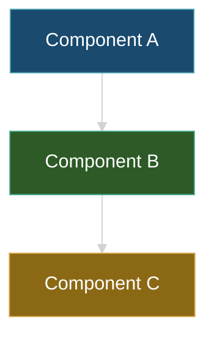

# {Feature Name} — Implementation Tracker

> Living design+status doc for {feature}.
> See `{path-to-related-research-or-design}` for {related doc}.
> Follows DOCS-PROTOCOL.md Rule 12.
> Updated: {YYYY-MM-DD}
> tests-deferred: {optional — set only if no automated test surface; cite BACKLOG entry. Per Rule 12 promotion gate.}

## AI Continuation Prompt

A fresh AI session picking up this work should read, in order:

1. `{path}` — {what context this provides}
2. `{path}` — {what context this provides}
3. This file — current phase + checklist

**Working state**: {one paragraph — where we are, what's working, what's not, what's the next phase}.

**What this IMPL is NOT**: {explicit anti-scope — features this IMPL won't deliver; prevents scope creep mid-build}.

**Naming convention**: `{FEATURE-SLUG}.{phase}.{n}` — e.g. `{FEATURE-SLUG}.2.1` for phase 2, task 1.

## Open Questions

> Spec Kit-style clarify step. ≤3 items. Mark resolved or accept default with rationale before P1 starts. See DOCS-PROTOCOL.md Rule 13.

1. **Q:** {ambiguity-targeted question — naming, scope boundary, dependency assumption, decision gap}
   **Resolution:** ___ (operator) — **default-accept: {default with rationale}**
2. **Q:** {question 2}
   **Resolution:** ___
3. **Q:** {question 3}
   **Resolution:** ___

> Cap of 3. If you have more than 3, the IMPL isn't ready — write more research first.

## Architecture

{One paragraph + a dark-themed Mermaid diagram capturing the load-bearing structure.}

### Design constraints

- **{Constraint 1}**: one-line rationale.
- **{Constraint 2}**: one-line rationale.

## Current State ({YYYY-MM-DD})

{Plain prose. What's working, what's not, what's the active phase. Updated every session that touches this IMPL.}

## Known Bugs

{Forward-looking anti-pattern guards OR retrospective bugs encountered during the build.}

- **BUG.1 — {symptom}**. {Suspected cause / debug approach / mitigation}.
- **BUG.2 — {symptom}**. {Suspected cause / debug approach / mitigation}.

> Resolved bugs stay listed with `~~strikethrough~~` + one-line resolution. Promotion (Rule 12) requires no open bugs.

## What Needs Testing

- **TEST.1** — {step-by-step test plan referencing concrete behavior}.
- **TEST.2** — {test plan 2}.
- **TEST.3** — {test plan 3}.

## Implementation Status

| Phase | State | Model | Description |
|---|---|---|---|
| P1 — {phase name} | Plan-only | {Sonnet / Opus} | {one-line description} |
| P2 — {phase name} | Plan-only | {Sonnet / Opus} | {one-line description} |
| P3 — {phase name} | Plan-only | {Sonnet / Opus} | {one-line description} |

> Model column: **Sonnet** for execution / wiring tasks following existing patterns. **Opus** for novel architecture / design tasks requiring new abstractions.

## Checklist

### P1 — {phase name} ({model}, ~{time estimate})

- [ ] **{FEATURE-SLUG}.1.1** — {concrete deliverable}.
- [ ] **{FEATURE-SLUG}.1.2** — {concrete deliverable}.
- [ ] **{FEATURE-SLUG}.1.3** — {concrete deliverable}.

### P2 — {phase name} ({model}, ~{time estimate})

> Rule 14 architect-mode required if this phase touches 2+ source-content files. Paste `## Plan — {FEATURE-SLUG}.2` before starting.

- [ ] **{FEATURE-SLUG}.2.1** — {concrete deliverable}.
- [ ] **{FEATURE-SLUG}.2.2** — {concrete deliverable}.

### P3 — {phase name} ({model}, ~{time estimate})

- [ ] **{FEATURE-SLUG}.3.1** — {concrete deliverable}.

## Key Files Reference

| File | Purpose |
|---|---|
| `{path/to/file.ext}` | {what role this file plays} |
| `{path/to/file.ext}` | {what role this file plays} |

## Architecture Notes

### Why {decision 1}

{One paragraph — the non-obvious reasoning future sessions need.}

### Why {decision 2}

{One paragraph.}

### Cross-IMPL sequencing

{If this IMPL has dependencies on other IMPLs, state them. A small Gantt mermaid helps when the dependency graph is non-trivial.}
