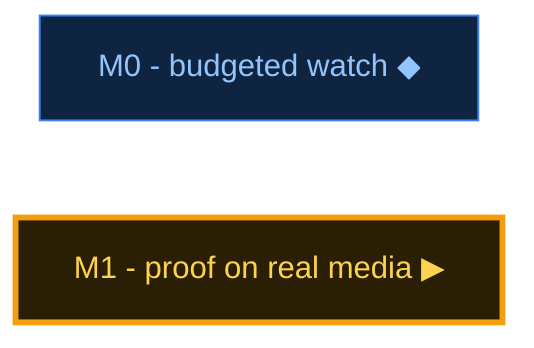

# ROADMAP.md -- llm-video-vision

> The live board (RoadMD v1). **The `roadmap` block below is the source of truth**;
> anything outside it is prose. Seeded by `ware new` / `ware rebirth` -- grow it with `/roadmap`.

```roadmap
v: 1
project: llm-video-vision
title: llm-video-vision
updated: 2026-09-23
north_star: "Token-budgeted video perception for any LLM: scene-aware frames, contact sheets, captions-first transcripts"
nodes:
  - id: m0
    title: M0 - budgeted watch
    kind: wave
    status: active
    note: watch/detail/lvw. One contact sheet, cap 12. Eval set still open.
  - id: m1
    title: M1 - proof on real media
    kind: wave
    status: next
    note: Live ffmpeg run plus the public eval set.
```

<!-- roadmap:render v1 begin -->
<!-- Generated by `ware roadmap render` from the ```roadmap block above -- DO NOT EDIT by hand. -->



Legend: ✓ done · ▶ next · ◆ active · ⛔ blocked · ▫ planned · ✗ descoped

| Node | Kind | Status | Next / done | Links |
|---|---|---|---|---|
| M0 - budgeted watch | wave | ◆ active | watch/detail/lvw. One contact sheet, cap 12. Eval set still open. | — |
| M1 - proof on real media | wave | ▶ next | Live ffmpeg run plus the public eval set. | — |

Progress: wave 0/2

<!-- roadmap:render end -->
